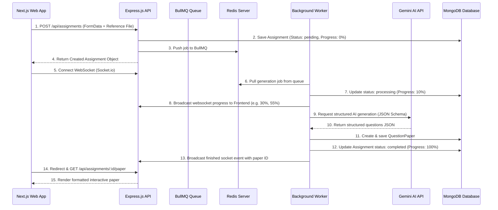

# VedaAI - AI Assessment Creator

VedaAI is a full-stack academic web application designed to help teachers generate structured, high-quality examination question papers from a simple configuration form, additional instructions, or source reference files (PDF/TXT) using AI.

---

## 🏗️ Architecture & Flow Overview



---

## 🛠️ Technology Stack

### **Backend:**
- **Runtime:** Node.js (v18+) with TypeScript
- **Framework:** Express.js
- **Database:** MongoDB (via Mongoose)
- **Message Broker:** Redis (via ioredis)
- **Background Jobs:** BullMQ
- **Real-Time Communication:** Socket.io
- **PDF Generation:** PDFKit

### **Frontend:**
- **Framework:** Next.js (App Router, v14) with TypeScript
- **State Management:** Redux Toolkit (RTK)
- **Websockets:** Socket.io-client
- **Styling:** Vanilla CSS (CSS Modules)
- **Icons:** Lucide React

---

## ⚙️ Setup & Installation Instructions

This project is separated into a `backend/` and `frontend/` folder.

### **Prerequisites:**
Before running, ensure you have the following installed on your machine:
1. **Node.js** (v18 or higher) & **npm**
2. **MongoDB** (running locally on port `27017` or an Atlas URI)
3. **Redis** (running locally on port `6379`)

---

### **1. Backend Service Configuration**

1. Open a terminal and navigate to the backend directory:
   ```bash
   cd backend
   ```
2. Install the backend dependencies:
   ```bash
   npm install
   ```
3. Create your `.env` file from the example:
   ```bash
   cp .env.example .env
   ```
4. Edit the `.env` file with your credentials:
   - **`MONGODB_URI`**: Set your MongoDB connection URI (e.g., `mongodb://localhost:27017/veda-ai`)
   - **`GEMINI_API_KEY`**: Paste your Google Gemini AI API key.
   - **`USE_MOCK_AI`**: If set to `true`, the backend bypasses Gemini calls and uses a highly structured topic-based mock generator (useful for testing without API keys).
5. Start the backend developer server:
   ```bash
   npm run dev
   ```

---

### **2. Frontend Service Configuration**

1. Open a new terminal and navigate to the frontend directory:
   ```bash
   cd ../frontend
   ```
2. Install the frontend dependencies:
   ```bash
   npm install
   ```
3. Create your `.env` file from the example:
   ```bash
   cp .env.example .env.local
   ```
4. Set the environment API endpoints (defaults match backend server on port 5000):
   ```
   NEXT_PUBLIC_API_URL=http://localhost:5000
   NEXT_PUBLIC_SOCKET_URL=http://localhost:5000
   ```
5. Start the frontend developer server:
   ```bash
   npm run dev
   ```
6. Open your browser and navigate to `http://localhost:3000`.

---

## 💡 Key Design Decisions & Approach

1. **BullMQ Background Processing:** Assessment creation involves file parsing and LLM prompts which can take up to 10 seconds. By offloading these tasks to BullMQ, the server remains responsive, and the frontend communicates progress in real-time.
2. **Redux State Management:** All states (assignment parameters, real-time log queues, and loaded question papers) are managed via Redux slices, separating UI layout code from logic.
3. **Structured Prompt JSON Schemas:** We utilize Gemini's strict schema JSON mode. This prevents the LLM from outputting unstructured markdown or text notes, guaranteeing that the questions, options, difficulty tags, and marks parse successfully.
4. **Editable Output Paper:** The output page renders like a physical print-ready exam sheet, but teachers can click inline text to modify questions or instructions. Unsaved edits trigger alert changes, saving straight back to the database.
5. **Print-Perfect PDF Kit Generation:** Rather than letting the user print HTML (which is prone to pagination and layout breakages), the backend builds an A4 layout using `pdfkit` complete with institutional margins, dotted student info lines, and page numbers.
