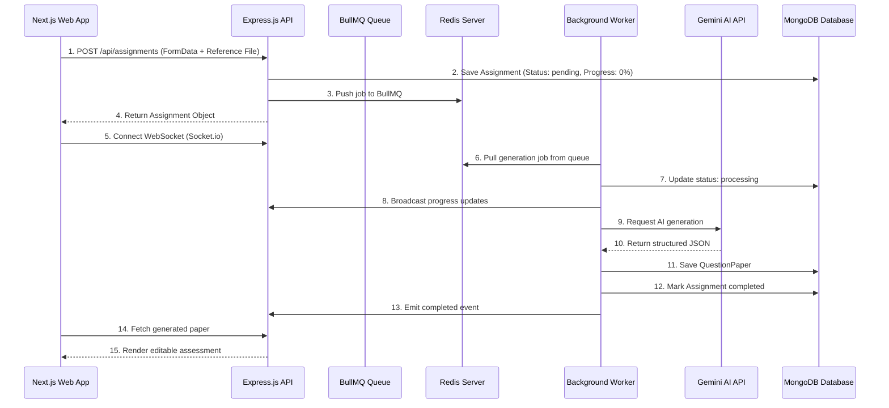

# AI Assessment Creator

AI Assessment Creator is a full-stack AI-powered academic platform that enables teachers to generate structured, high-quality examination question papers from simple configuration forms, additional instructions, or uploaded reference documents (PDF/TXT).

The system leverages AI generation, background job queues, real-time websocket progress tracking, and editable print-ready paper rendering to streamline the assessment creation process.

---

# 🚀 Features

- AI-powered question paper generation using Gemini AI
- Upload PDF/TXT reference materials
- Real-time generation progress using WebSockets
- Background processing with BullMQ + Redis
- Editable generated assessment interface
- Print-ready PDF export
- Redux-powered frontend state management
- Modern responsive UI with Next.js
- Structured JSON schema-based AI prompting
- Queue-based scalable architecture

---

# 🏗️ System Architecture



---

# 🛠️ Tech Stack

## Frontend
- Next.js 14 (App Router)
- TypeScript
- Redux Toolkit
- Socket.io Client
- CSS Modules
- Lucide React

## Backend
- Node.js
- Express.js
- TypeScript
- MongoDB + Mongoose
- Redis + ioredis
- BullMQ
- Socket.io
- PDFKit

---

# 📂 Project Structure

```bash
AI-Assessment-Creator/
│
├── backend/
│   ├── src/
│   ├── uploads/
│   ├── workers/
│   ├── routes/
│   ├── controllers/
│   ├── models/
│   └── services/
│
├── frontend/
│   ├── app/
│   ├── components/
│   ├── store/
│   ├── styles/
│   └── public/
│
└── README.md
```

---

# ⚙️ Local Setup Instructions

## Prerequisites

Install the following before starting:

- Node.js v18+
- MongoDB
- Redis
- npm

---

# 🔧 Backend Setup

## Step 1: Navigate to backend

```bash
cd backend
```

## Step 2: Install dependencies

```bash
npm install
```

## Step 3: Create .env file

Create a `.env` file inside `backend/`

```env
PORT=5000

MONGODB_URI=your_mongodb_connection_uri

REDIS_URL=redis://127.0.0.1:6379

GEMINI_API_KEY=your_gemini_api_key

USE_MOCK_AI=false
```

## Step 4: Start backend server

```bash
npm run dev
```

Backend runs on:

```bash
http://localhost:5000
```

---

# 🎨 Frontend Setup

## Step 1: Navigate to frontend

```bash
cd frontend
```

## Step 2: Install dependencies

```bash
npm install
```

## Step 3: Create .env.local

```env
NEXT_PUBLIC_API_URL=http://localhost:5000

NEXT_PUBLIC_SOCKET_URL=http://localhost:5000
```

## Step 4: Start frontend

```bash
npm run dev
```

Frontend runs on:

```bash
http://localhost:3000
```

---

# ☁️ Deployment

## Frontend Deployment (Vercel)

Deploy frontend using:

### Root Directory
```bash
frontend
```

### Build Command
```bash
npm run build
```

### Install Command
```bash
npm install
```

---

## Backend Deployment (Render)

Deploy backend using:

### Root Directory
```bash
backend
```

### Build Command
```bash
npm install && npm run build
```

### Start Command
```bash
npm start
```

---

# 🔑 Environment Variables

## Backend

```env
PORT=5000
MONGODB_URI=
REDIS_URL=
GEMINI_API_KEY=
USE_MOCK_AI=false
```

## Frontend

```env
NEXT_PUBLIC_API_URL=
NEXT_PUBLIC_SOCKET_URL=
```

---

# 💡 Key Design Decisions

## 1. BullMQ Background Processing

AI generation and file parsing are long-running operations. BullMQ keeps the API responsive while workers process jobs asynchronously.

## 2. Real-Time Progress Tracking

Socket.io streams live progress updates from backend workers to the frontend UI.

## 3. Structured AI Generation

Gemini AI uses strict JSON schema prompting to ensure predictable and parseable outputs.

## 4. Editable Question Papers

Generated papers remain editable after generation for teachers to customize content before exporting.

## 5. Print-Perfect PDF Export

PDFKit generates properly paginated A4-format exam sheets with professional formatting.

---

# 🔮 Future Improvements

- Authentication & Role-Based Access
- AI Difficulty Balancing
- Multi-language Question Generation
- Analytics Dashboard
- Cloud File Storage
- Collaborative Editing
- Question Bank Management
